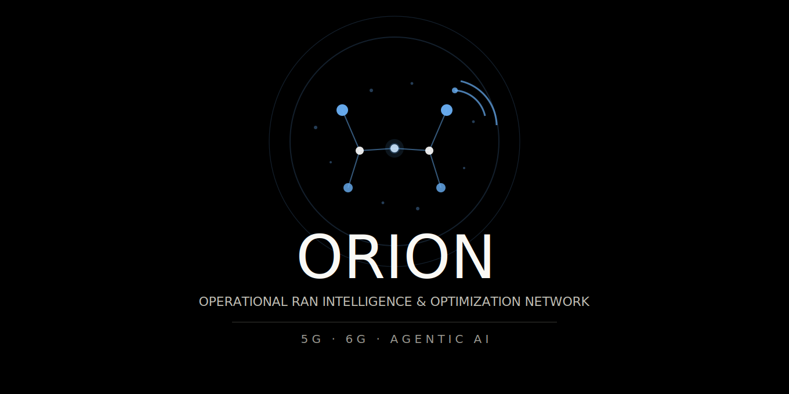
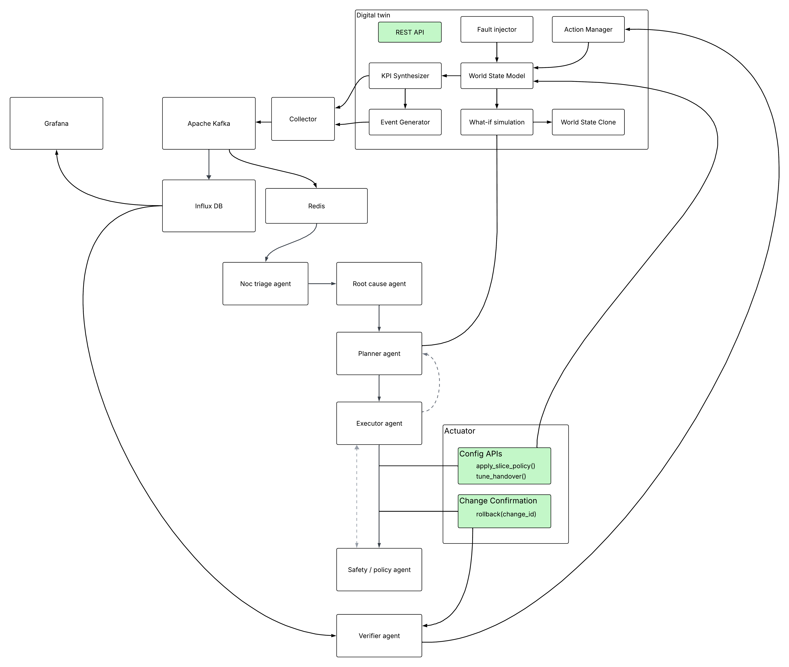

# ORION 🛰️
<<<<<<< HEAD
> Operational RAN Intelligence & Optimization Network

=======

<p align="center">
  
</p>

> Operational RAN Intelligence & Optimization Network

>>>>>>> f2faaf500c4d7c58508838c58fd646a7abc3139a
An autonomous AI-powered Network Operations Center (NOC) for 5G/6G infrastructure — built on a digital twin simulation engine and a multi-agent AI pipeline.

---

## What it does

- **Digital Twin** — SimPy-based 5G RAN simulator generating realistic KPIs (PRB, SINR, latency, throughput) driven by real Milan traffic data
- **Multi-Agent AI** — Six specialized agents (Triage → Root Cause → Planner → Safety → Executor → Verifier) running a closed-loop `Detect → Decide → Act → Verify` cycle
- **Autonomous NOC** — Detects incidents, diagnoses root causes, proposes and executes remediations, and rolls back if things get worse

---

## Architecture

<p align="center">
  
</p>

---

---

## Milestones

- [x] **M1** — Digital Twin + Telemetry ✅
- [ ] **M2** — Triage & Root Cause Agents
- [ ] **M3** — Planner + First Closed Loop
- [ ] **M4** — Safety Guardrails + Full Autonomy
- [ ] **M5** — 6G Extensions + Reinforcement Learning

---

## Quick Start

```bash
git clone https://github.com/L-N-X-1/aura-net-lab.git
cd orion
make up
```

Services will be available at:

| Service      | URL                   |
|--------------|-----------------------|
| API Gateway  | http://localhost:8000 |
| Grafana      | http://localhost:3001 |
| Digital Twin | http://localhost:8001 |
| InfluxDB     | http://localhost:8086 |

---

## Digital Twin — Getting Started

> ✅ M1 complete — the digital twin is live and producing KPIs.

### 1. Download the Dataset

Download the Milan mobile phone activity dataset from Kaggle and place the CSV files under `/data/csv/`:

```
https://www.kaggle.com/datasets/marcodena/mobile-phone-activity
```

Expected directory structure:

```
orion/
└── data/
    └── csv/
    └── telecom/
```

### 2. Supported CSV Format

The twin natively supports the **Italian Telecom 2013** dataset and any compatible CSV sharing the same schema:

| Column     | Type      | Description                      |
|------------|-----------|----------------------------------|
| `CellID`   | integer   | Grid square identifier           |
| `Datetime` | timestamp | UTC timestamp of the measurement |
| `smsin`    | float     | Incoming SMS activity            |
| `smsout`   | float     | Outgoing SMS activity            |
| `callin`   | float     | Incoming call activity           |
| `callout`  | float     | Outgoing call activity           |
| `internet` | float     | Internet traffic activity        |

Any CSV that follows this column structure (same names, same types) is accepted — the loader is not hardcoded to the Italian Telecom source. Bring your own compatible dataset and it will work out of the box.

### 3. Choose a Data-Loading Mode

The twin supports two modes for mapping CSV rows to simulated cells, configured via `DATASET_SOURCES` in your `.env`:

| Mode | Description |
|------|-------------|
| **Auto-assign** | Load all CSVs from `/data/csv/` and let the twin distribute rows across cells automatically. Good for quick runs and exploratory testing. |
| **Dedicated-cell** | Explicitly bind each CSV (and a specific row filter) to a named cell. Better spatial fidelity and reproducible KPI traces per cell. |

### 4. Configure `DATASET_SOURCES`

Each entry follows the format `CellID:filepath:FilterColumn:FilterValue:DataType`, pipe-separated:

```dotenv
DATASET_SOURCES=C00:/data/telecom.csv:CellID:4455:internet|C01:/data/telecom.csv:CellID:4456:internet|C10:/data/telecom.csv:CellID:5055:internet|C11:/data/telecom.csv:CellID:5056:internet|C20:/data/smartmeter.csv:LCLid:MAC000002:energy|C21:/data/smartmeter.csv:LCLid:MAC000003:energy
```

Field breakdown:

| Field          | Description                         | Example             |
|----------------|-------------------------------------|---------------------|
| `CellID`       | Logical cell label used internally  | `C00`               |
| `Filepath`     | Path to the CSV file                | `/data/telecom.csv` |
| `FilterColumn` | Column to filter on                 | `CellID`            |
| `FilterValue`  | Row value to select                 | `4455`              |
| `DataType`     | Signal type hint for KPI generation | `internet / energy` |

---

## KPIs Generated

The digital twin produces the following KPIs per cell, every < 5 seconds:

| KPI                  | Unit  | Description                                      |
|----------------------|-------|--------------------------------------------------|
| `prb_util`           | %     | Physical Resource Block utilization              |
| `throughput_mbps`    | Mbps  | Actual data rate served to users                 |
| `sinr_db`            | dB    | Signal-to-Interference-plus-Noise Ratio          |
| `cqi`                | 0–15  | Channel Quality Indicator reported by UEs        |
| `latency_p95_ms`     | ms    | 95th-percentile end-to-end latency               |
| `packet_loss_pct`    | %     | Packet drop rate                                 |
| `cpu_load`           | %     | Estimated gNodeB baseband processing load        |
| `ho_fail_rate`       | ratio | Fraction of handover attempts that failed        |
| `energy_mode`        | enum  | Cell state: ACTIVE / SLEEP / SHUTDOWN            |
| `sla_violation`      | bool  | Whether the cell is currently breaching its SLA  |

---

## Fault Injection Scenarios

The twin ships with a fault injector supporting five canonical scenarios:

| Scenario               | Fault Mechanism                                         | Agents Exercised                              |
|------------------------|---------------------------------------------------------|-----------------------------------------------|
| Evening Congestion     | Dataset load peaks 18:00–22:00, PRB > 95% for 3 ticks  | Triage, Root Cause, Planner, Executor, Verifier |
| Backhaul Degradation   | Link delay set to 150ms, loss to 5%                     | Triage, Root Cause, Planner                   |
| Mobility Storm         | A3 offset near-zero, excessive HO attempts              | Triage, Root Cause, Planner                   |
| Policy Misconfiguration| Slice priority inverted, premium throughput drops       | Triage, Root Cause, Executor, Verifier        |
| Energy Saving Failure  | SLEEP mode during peak load, PRB overflow               | Triage, Root Cause, Planner, Safety, Executor, Verifier |

---

## Safety Guardrails

The Executor Agent is gated by the following non-negotiable safety mechanisms:

| Guardrail             | Description                                                                 |
|-----------------------|-----------------------------------------------------------------------------|
| Policy Enforcement    | Blocks sensitive operations (e.g. power-mode changes) during peak hours     |
| Rate Limiting         | Max 3 configuration changes per 10-minute window                            |
| Blast Radius Checks   | Any action affecting > 10 cells requires manual AI Supervisor approval      |
| Automatic Rollback    | Immediate state restoration if post-action KPIs worsen                      |

---

## Target Performance Metrics

| Metric            | Description                                          | Target  |
|-------------------|------------------------------------------------------|---------|
| MTTD              | Mean Time to Detect from KPI deviation               | < 2 min |
| MTTR              | Mean Time to Recover normal service levels           | < 5 min |
| SLA Score         | % of time network slices meet constraints            | > 95%   |
| Automation Rate   | % of incidents resolved autonomously                 | > 70%   |
| Action Safety     | Rate of policy violations or required rollbacks      | < 2%    |
| Energy Efficiency | Energy reduction while maintaining performance       | -20%    |

---

## Progress

Follow along on [LinkedIn](https://www.linkedin.com/in/mohamed-rayen-ben-azouz-658667302/) as I build this milestone by milestone.

---

*Built as a home lab project exploring 5G network automation and agentic AI.*
