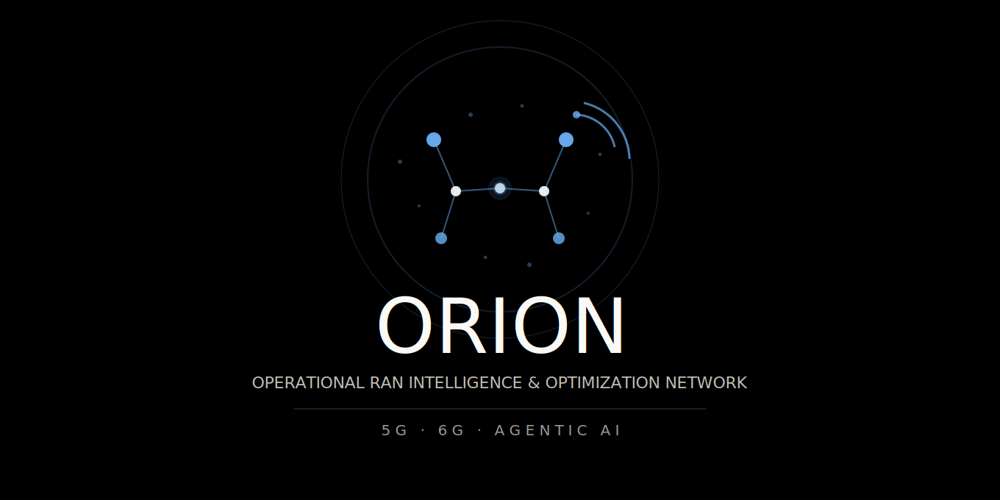
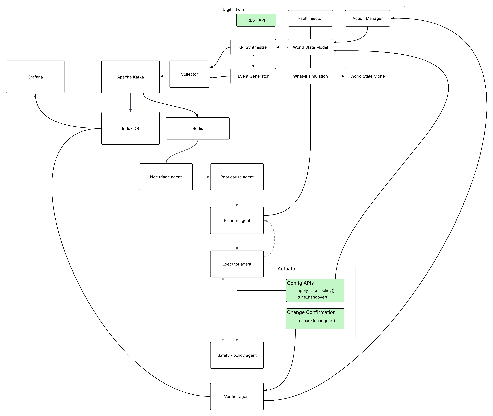

# ORION 🛰️

<p align="center">
  
</p>

> Operational RAN Intelligence & Optimization Network

An autonomous AI-powered Network Operations Center (NOC) for 5G/6G infrastructure — built on a digital twin simulation engine and a multi-agent LangGraph AI pipeline that closes the loop from anomaly detection to verified remediation.

---

## What it does

- **Digital Twin** — SimPy-based 5G RAN simulator generating realistic KPIs (PRB, SINR, latency, throughput) driven by real Milan traffic data
- **Multi-Agent AI** — Seven specialized agents (Triage → Root Cause → Planner → Safety → Human Approval → Executor → Verifier) running a closed-loop `Detect → Decide → Act → Verify` cycle
- **LLM-Driven Decisions** — LLM actively selects remediation actions, adjusts root-cause hypothesis confidence, provides contextual safety review, and generates full post-incident reports
- **Anomaly Detection** — Background loop scans KPI trends every 30 s and fires early-warning events before thresholds breach
- **Human-in-the-Loop** — Safety gate interrupts pipeline for operator approval when required; resumes autonomously after decision
- **Autonomous NOC** — Detects incidents, diagnoses root causes, proposes and executes remediations, rolls back if things get worse, and writes a structured post-incident report
- **Web Dashboard** — React + Tailwind UI with per-cell multi-line KPI sparklines, live pending-approval panel (polls Redis every 5 s), dark mode, fault injection trigger, and memory store inspector

---

## Architecture

> **Repo layout:** ORION is two independent stacks, each with its own
> `docker-compose.yml` — [`digital-twin/`](digital-twin/) (the RAN simulator)
> and [`agentic-ai/`](agentic-ai/) (the LangGraph pipeline, actuator,
> collector, api-gateway, and dashboard). They are not networked together
> yet — that correlation (letting agentic-ai reach the twin's REST API and
> Kafka events) is a deliberate follow-up, not done in this pass. Each stack
> runs and is developed on its own until then.

<p align="center">
  
</p>

*(diagram predates the digital-twin/agentic-ai split above and still shows
them as one connected stack — accurate for the logical data flow, not for
the current physical repo/deployment layout.)*

### Agent Pipeline

```
START → Triage → Root Cause → Planner → Safety ──(ALLOW)──────────────→ Executor → Verifier → END
                                                └─(ALLOW_WITH_APPROVAL)→ Human Approval ──(approved)→ Executor → Verifier → END
                                                └─(DENY / halted)──────→ END
```

### LLM Role Per Agent

| Agent | LLM does | Fallback |
|---|---|---|
| **Triage** | Writes operator-readable incident summary (type, severity, affected cells, KPI evidence) | Template string |
| **Root Cause** | Adjusts hypothesis confidence scores based on KPI evidence; writes RCA narrative | Original deterministic ranking |
| **Planner** | Selects best remediation action from catalogue (`chosen_index` + `rationale`) | Max expected KPI improvement |
| **Safety** | Contextual secondary review when rules return ALLOW; can escalate to human approval | Keep deterministic ALLOW |
| **Verifier** | Generates full post-incident report: what happened, root cause, action, KPI before/after, lessons learned | Template fallback |

All decisions that affect the network are backed by deterministic guardrails — LLM enriches and decides, rules enforce hard limits.

---

## Milestones

- [x] **M1** — Digital Twin + Telemetry ✅
- [x] **M2** — Triage & Root Cause Agents ✅
- [x] **M3** — Planner + First Closed Loop ✅
- [x] **M4** — Safety Guardrails + Human Approval + Full Autonomy ✅
- [x] **M4.5** — LLM-Driven Decisions + Anomaly Detection + Post-Incident Reports ✅
- [ ] **M5** — 6G Extensions + Reinforcement Learning

---

## Quick Start

ORION is two separate stacks now. Bring up whichever one(s) you need —
they don't depend on each other to start.

```bash
git clone https://github.com/L-N-X-1/ORION.git
cd ORION

# Digital twin (RAN simulator + its own Kafka/InfluxDB/Grafana)
cd digital-twin && make up && cd ..

# Agentic AI (LangGraph pipeline + actuator/collector/api-gateway + dashboard)
cd agentic-ai && make up && cd ..
```

> Ollama must be running on the host with a model pulled (default: `llama3.2`).
> Override with `OLLAMA_MODEL=llama3.2:3b` in `agentic-ai/.env` for faster inference.

Digital twin stack:

| Service       | URL                    |
|---------------|------------------------|
| Digital Twin  | http://localhost:8001  |
| Grafana       | http://localhost:3001  |
| InfluxDB      | http://localhost:18086 |

Agentic AI stack:

| Service       | URL                    |
|---------------|------------------------|
| Dashboard     | http://localhost:3000  |
| API Gateway   | http://localhost:8000  |
| AI Agent      | http://localhost:8004  |
| Prometheus    | http://localhost:9090  |

The dashboard's Digital Twin controls and `/api/twin/*` routes are currently
non-functional in isolation — they call the twin service, which isn't on the
agentic-ai docker network. See the correlation note above.

---

## Web Dashboard

Open `http://localhost:3000` after `cd agentic-ai && make up`.

| Page | Description |
|---|---|
| **Dashboard** | Per-cell multi-line KPI sparklines (PRB, Throughput, Latency, SINR, HO Fail, Packet Loss, SLA), live service health cards, recent events feed. Dark mode toggle (🌙/☀️) in header. |
| **Digital Twin** | Per-cell KPI history, fault injection & restore, handover tuning, energy mode, slice policy controls. **Currently non-functional** — this page calls the twin service directly, which isn't reachable from the agentic-ai stack until the two are networked together. |
| **AI Agent** | Inject fault scenarios to trigger the LangGraph pipeline. **Pending Approvals** panel polls the agent every 5 s and shows any pipeline suspended at the Human Approval gate with one-click Approve / Reject. |
| **Actuator** | Manual rollback, slice policy, handover, and energy mode controls with audit trail. |

Grafana dashboards (twin KPIs, part of the digital-twin stack): `http://localhost:3001` after `cd digital-twin && make up`.

---

## Triggering the Closed Loop

> These examples assume the digital-twin and agentic-ai stacks are
> networked together so the twin's fault-injection can reach the agent
> pipeline (see the correlation note in Architecture above) — they won't
> work end-to-end against two isolated stacks yet.

### Ephemeral fault injection (recommended)

Injects a synthetic congestion fault directly into the KPI synthesis layer, fires an event to the agent pipeline, and clears automatically when the agent applies the remediation:

```powershell
# 1. Inject fault — note the event_id returned
Invoke-WebRequest -Uri http://localhost:8001/fault/inject-agent `
  -Method POST -ContentType "application/json" `
  -Body '{"scenario":"evening_congestion"}' | Select-Object -Expand Content

# 2. Pipeline will return 202 + approve_url if human approval required
#    Approve it:
Invoke-WebRequest -Uri http://localhost:8004/approvals/<incident_id>/decision `
  -Method POST -ContentType "application/json" `
  -Body '{"decision":"approved","approver":"ops@example.com"}' | Select-Object -Expand Content

# 3. Check PRB restored after executor runs
Invoke-WebRequest -Uri http://localhost:8001/metrics | Select-Object -Expand Content

# 4. Restore fault manually if needed (skips agent)
Invoke-WebRequest -Uri http://localhost:8001/fault/restore-agent `
  -Method POST -ContentType "application/json" `
  -Body '{"scenario":"evening_congestion"}' | Select-Object -Expand Content
```

### Trigger pipeline directly

```powershell
Invoke-WebRequest -Uri http://localhost:8004/run `
  -Method POST -ContentType "application/json" `
  -Body '{
    "event_id": "test-001",
    "correlation_id": "test-001",
    "event_type": "CONGESTION",
    "entity_id": "C00",
    "severity_hint": "high",
    "sim_time_s": 0,
    "timestamp": "2026-01-01T12:00:00Z"
  }' | Select-Object -Expand Content
```

A `202 awaiting_approval` response means the pipeline paused at the human approval gate. Use the `approve_url` from the response body to resume.

---

## Digital Twin — Getting Started

Everything below applies to the standalone `digital-twin/` stack (`cd digital-twin && make up`) — it doesn't require agentic-ai running.

### 1. Download the Dataset

Download the Milan mobile phone activity dataset from Kaggle and place the CSV files under `digital-twin/data/csv/`:

```
https://www.kaggle.com/datasets/marcodena/mobile-phone-activity
```

Expected directory structure:

```
orion/
└── digital-twin/
    └── data/
        └── csv/
```

### 2. Supported CSV Format

The twin natively supports the **Italian Telecom 2013** dataset and any compatible CSV sharing the same schema:

| Column     | Type      | Description                      |
|------------|-----------|----------------------------------|
| `CellID`   | integer   | Grid square identifier           |
| `Datetime` | timestamp | UTC timestamp of the measurement |
| `smsin`    | float     | Incoming SMS activity            |
| `smsout`   | float     | Outgoing SMS activity            |
| `callin`   | float     | Incoming call activity           |
| `callout`  | float     | Outgoing call activity           |
| `internet` | float     | Internet traffic activity        |

Any CSV that follows this column structure is accepted — the loader is not hardcoded to the Italian Telecom source.

### 3. Choose a Data-Loading Mode

| Mode | Description |
|------|-------------|
| **Auto-assign** | Load all CSVs from `digital-twin/data/csv/` and distribute rows across cells automatically. |
| **Dedicated-cell** | Explicitly bind each CSV (and a row filter) to a named cell. Better spatial fidelity. |

### 4. Configure `DATASET_SOURCES`

Each entry: `CellID:filepath:FilterColumn:FilterValue:DataType`, pipe-separated:

```dotenv
DATASET_SOURCES=C00:/data/telecom.csv:CellID:4455:internet|C01:/data/telecom.csv:CellID:4456:internet|C10:/data/telecom.csv:CellID:5055:internet|C11:/data/telecom.csv:CellID:5056:internet
```

---

## KPIs Generated

The digital twin produces the following KPIs per cell, every ~5 seconds:

| KPI                  | Unit  | Description                                      |
|----------------------|-------|--------------------------------------------------|
| `prb_util`           | %     | Physical Resource Block utilization              |
| `throughput_mbps`    | Mbps  | Actual data rate served to users                 |
| `sinr_db`            | dB    | Signal-to-Interference-plus-Noise Ratio          |
| `cqi`                | 0–15  | Channel Quality Indicator reported by UEs        |
| `latency_p95_ms`     | ms    | 95th-percentile end-to-end latency               |
| `packet_loss_pct`    | %     | Packet drop rate                                 |
| `cpu_load`           | %     | Estimated gNodeB baseband processing load        |
| `ho_fail_rate`       | ratio | Fraction of handover attempts that failed        |
| `energy_mode`        | enum  | Cell state: ACTIVE / SLEEP / SHUTDOWN            |
| `sla_violation`      | bool  | Whether the cell is currently breaching its SLA  |

---

## Fault Injection Scenarios

| Scenario                    | Mechanism                                              | Type                      |
|-----------------------------|--------------------------------------------------------|---------------------------|
| Evening Congestion (pinned) | Dataset load peaks 18:00–22:00, PRB > 95% for 3 ticks | SimPy-pinned (persistent) |
| Agent Evening Congestion    | Synthetic PRB override at KPI layer, no SimPy pin      | Ephemeral (agent-clearable) |
| Backhaul Degradation        | Link delay 150 ms, packet loss 5%                      | SimPy-pinned              |
| Mobility Storm              | A3 offset near-zero, excessive HO attempts             | SimPy-pinned              |
| Policy Misconfiguration     | Slice priority inverted, premium throughput drops      | SimPy-pinned              |
| Energy Saving Failure       | SLEEP mode during peak load, PRB overflow              | SimPy-pinned              |

---

## Safety Guardrails

| Guardrail              | Description                                                                  |
|------------------------|------------------------------------------------------------------------------|
| Policy Enforcement     | Blocks energy-saving mode changes during peak hours (08:00–22:00 UTC)       |
| Rate Limiting          | Max 3 configuration changes per 10-minute window                             |
| Blast Radius Check     | Actions affecting > 10 cells require human approval                          |
| LLM Contextual Review  | Secondary LLM check when rules pass — can escalate to human approval         |
| Human Approval Gate    | LangGraph `interrupt()` pauses pipeline; operator resumes via REST API       |
| Automatic Rollback     | Immediate state restoration if post-action KPIs worsen                       |

---

## Post-Incident Reports

After every completed pipeline run the Verifier generates a structured LLM report containing:

- **Incident summary** — type, severity, affected cells, detection time
- **Root cause** — dominant hypothesis, confidence score, supporting KPIs
- **Action taken** — action type, parameters, planner rationale, approval source
- **KPI comparison** — before → after table (PRB, latency, throughput, SLA, HO fail rate)
- **Outcome** — SUCCESS / REGRESSION + rollback note if applicable
- **Lessons learned** — LLM-generated takeaways

Report is stored in `VerificationReport.postmortem` and printed to agent logs at `INFO` level.

---

## Target Performance Metrics

| Metric            | Description                                          | Target  |
|-------------------|------------------------------------------------------|---------|
| MTTD              | Mean Time to Detect from KPI deviation               | < 2 min |
| MTTR              | Mean Time to Recover normal service levels           | < 5 min |
| SLA Score         | % of time network slices meet constraints            | > 95%   |
| Automation Rate   | % of incidents resolved autonomously                 | > 70%   |
| Action Safety     | Rate of policy violations or required rollbacks      | < 2%    |
| Energy Efficiency | Energy reduction while maintaining performance       | -20%    |

---

## Progress

Follow along on [LinkedIn](https://www.linkedin.com/in/mohamed-rayen-ben-azouz-658667302/) as I build this milestone by milestone.

---

*Built as a home lab project exploring 5G network automation and agentic AI.*
